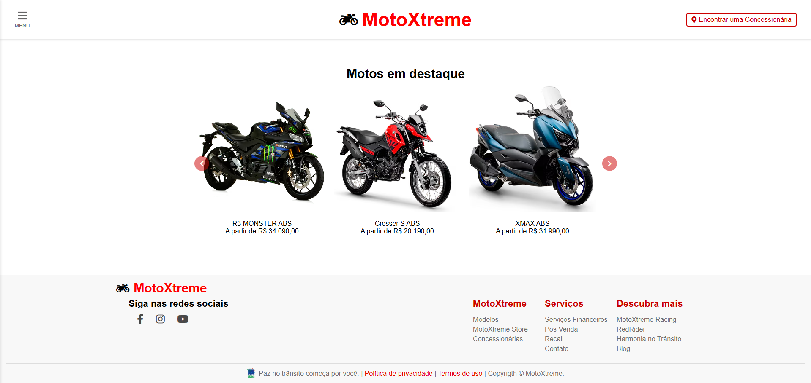
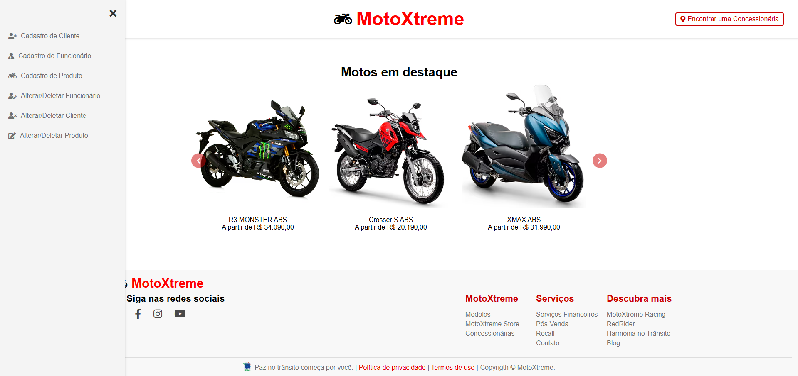
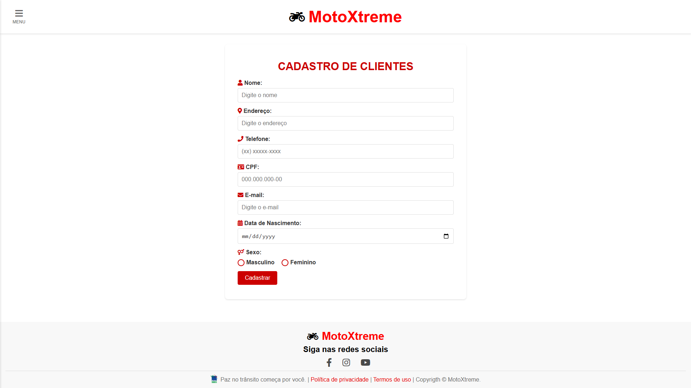
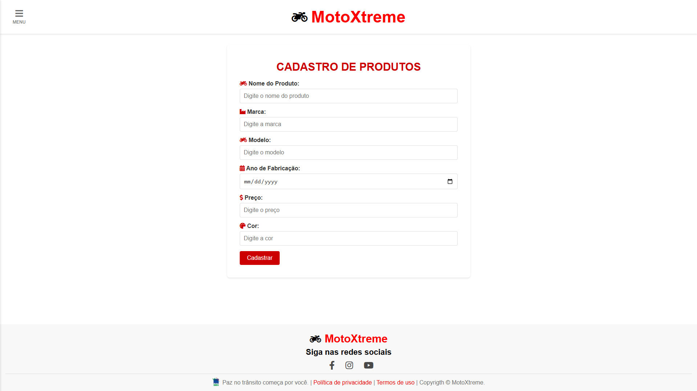
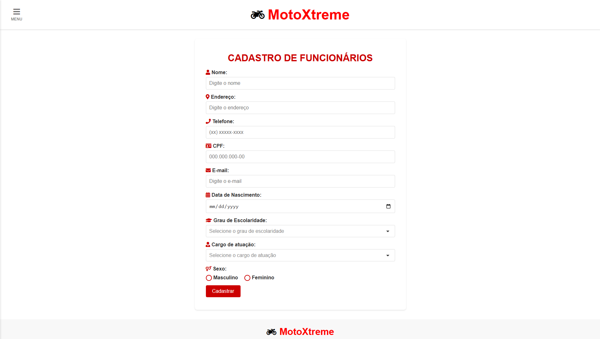

# 🏍️ MotoXtreme - Sistema de Cadastro e Gerenciamento de Vendas de Motos


---

## 📚 Finalidade

Este projeto foi desenvolvido como **projeto acadêmico**, atividade **avaliativa**, no **Curso Técnico em Informática**, com o objetivo de praticar:

* Desenvolvimento Full Stack (front-end e back-end).
* Integração com banco de dados relacional.
* Estruturação e manipulação de formulários.

---

## ✅ Funcionalidades

* 📋 Cadastro de clientes com dados pessoais.
* 👩‍💼 Cadastro de funcionários com informações profissionais.
* 🛵 Cadastro de produtos (motos) com detalhes técnicos.
* 🗄️ Armazenamento e manipulação de dados via **MySQL**.
* 🖥️ Interfaces simples e funcionais para interação com o sistema.

---

## 🛠️ Tecnologias utilizadas

* HTML5, CSS3, JavaScript
* PHP (com MySQLi)
* MySQL
* Font Awesome
* Google Fonts

---

## 🚀 Como executar o projeto

1. Clone este repositório:

```bash
   git clone https://github.com/seu-usuario/projetomotoxtreme.git
```

2. Configure o servidor local (**XAMPP**).

3. Execute o script SQL para criar o banco de dados e as tabelas:

```sql
CREATE DATABASE IF NOT EXISTS banco_projetomotoxtreme;
USE banco_projetomotoxtreme;

CREATE TABLE IF NOT EXISTS clientes (
  id INT AUTO_INCREMENT PRIMARY KEY,
  nome VARCHAR(100) NOT NULL,
  end VARCHAR(150),
  fone VARCHAR(20),
  cpf VARCHAR(14) UNIQUE,
  email VARCHAR(100),
  dn DATE,
  sexo ENUM('M','F','Outro') DEFAULT 'Outro',
  created_at TIMESTAMP DEFAULT CURRENT_TIMESTAMP
);

CREATE TABLE IF NOT EXISTS funcionarios (
  id INT AUTO_INCREMENT PRIMARY KEY,
  nome VARCHAR(100) NOT NULL,
  end VARCHAR(150),
  fone VARCHAR(20),
  cpf VARCHAR(14) UNIQUE,
  email VARCHAR(100),
  dn DATE,
  escolaridade VARCHAR(50),
  cargo VARCHAR(50),
  sexo ENUM('M','F','Outro') DEFAULT 'Outro',
  created_at TIMESTAMP DEFAULT CURRENT_TIMESTAMP
);

CREATE TABLE IF NOT EXISTS produtos (
  id INT AUTO_INCREMENT PRIMARY KEY,
  nome_produto VARCHAR(100) NOT NULL,
  marca VARCHAR(50),
  modelo VARCHAR(50),
  ano_fabricacao YEAR,
  preco DECIMAL(10,2),
  cor VARCHAR(30),
  created_at TIMESTAMP DEFAULT CURRENT_TIMESTAMP
);
```

4. Coloque os arquivos do projeto na pasta `htdocs` (caso use **XAMPP**).

5. Acesse via navegador:

```
http://localhost/projetomotoxtreme
```

---

## 📸 Prints do Sistema

### 🖼️ Tela Inicial





### 🖼️ Tela de cadastro de clientes



### 🖼️ Tela de cadastro de produtos



### 🖼️ Tela de cadastro de funcionários



---

## 🤝 Contribuição

Projeto desenvolvido por **Angelita Luz** durante o **Curso Técnico em Informática**.

---